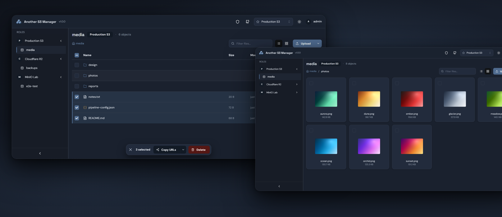

# Another S3 Manager

Lightweight, self-hosted web UI for managing files across multiple S3-compatible storage providers.

Works with **AWS S3**, **MinIO**, **Cloudflare R2**, **Wasabi**, and any S3-compatible API.

<p align="center">
  <a href="https://github.com/kruchenburger/another-s3-manager/releases"></a>
  <a href="https://github.com/kruchenburger/another-s3-manager/actions/workflows/ci.yml"></a>
  <a href="LICENSE"></a>
</p>

<p align="center">
  
</p>

## Quick Start

```bash
docker run -d -p 8080:8080 \
  -e JWT_SECRET_KEY=$(openssl rand -base64 32) \
  -v s3m-data:/app/data \
  ghcr.io/kruchenburger/another-s3-manager:latest
```

Open `http://localhost:8080` and log in with `admin` / `change_me_pls`. Persistent state
(SQLite DB, `config.json`, etc.) lives in the `s3m-data` named Docker volume — works out
of the box on Linux/macOS/Windows because Docker initializes named volumes with the
image's user ownership (the container runs as non-root `app` / uid 1001).

If you prefer a host-bind mount (`-v $(pwd)/data:/app/data`), on **Linux** you must
`mkdir -p data && sudo chown 1001:1001 data` first or the non-root user can't write.

For a `docker compose` setup see [`docker-compose.example.yml`](docker-compose.example.yml).

## Features

- **Multi-provider** — connect AWS accounts, MinIO, R2, Wasabi in one UI
- **Multi-account** — switch between roles (default credentials, named profiles, assume role, direct keys)
- **Fast file browser** — table + grid views with image thumbnails; virtualized lists stay smooth in 10k+ object folders
- **Upload & download** — single files, multiple files, or entire folders; drag-and-drop supported
- **Bulk operations** — multi-select with bulk delete and bulk link copying
- **File preview** — images, video, PDF and text inline (text extensions are admin-configurable)
- **Share links** — presigned URLs with a configurable lifetime, per-link override up to 7 days
- **Server-side search** — prefix search inside folders too large to load client-side
- **User management** — per-role and per-bucket access, configurable password policy, forced first-login password change
- **MCP server** — AI agents (Claude Desktop, Cursor) browse the same storage with the same permissions
- **Observability** — Prometheus `/metrics`, optional structured JSON logs
- **Security** — JWT in an httpOnly cookie, bcrypt passwords, CSRF protection, per-username ban after failed logins
- **Dark / light theme**

## Configuration

Configure roles through the web UI (**Admin console → Roles**; global settings live under
**Admin console → Settings**) or by editing `config.json`:

```json
{
  "roles": [
    {
      "name": "AWS Production",
      "type": "assume_role",
      "role_arn": "arn:aws:iam::123456789012:role/S3Access"
    },
    {
      "name": "Dev Account",
      "type": "credentials",
      "access_key_id": "AKIA...",
      "secret_access_key": "..."
    },
    {
      "name": "Local MinIO",
      "type": "credentials",
      "access_key_id": "minioadmin",
      "secret_access_key": "minioadmin",
      "endpoint_url": "http://minio:9000",
      "path_style": true
    }
  ]
}
```

Role types: `default`, `profile`, `assume_role`, `credentials`. Any role can include `endpoint_url`, `use_ssl`, `verify_ssl`, `path_style` for S3-compatible services.

## Environment Variables

| Variable                          | Description                                                                      | Default              |
| --------------------------------- | -------------------------------------------------------------------------------- | -------------------- |
| `JWT_SECRET_KEY`                  | **Required.** Secret for JWT tokens                                              | —                    |
| `ADMIN_PASSWORD`                  | Initial admin password                                                           | `change_me_pls`      |
| `PORT`                            | Server port                                                                      | `8080`               |
| `AWS_REGION`                      | Default AWS region                                                               | from env             |
| `DATA_DIR`                        | Directory for SQLite DB and runtime data                                         | `/app/data`          |
| `MAX_FILE_SIZE`                   | Max upload size in bytes                                                         | `104857600` (100 MB) |
| `DISABLE_DELETION`                | Disable delete operations                                                        | `false`              |
| `COOKIE_SECURE`                   | Auth cookie `Secure` flag — set to `false` for local HTTP, `true` for HTTPS prod | `true`               |
| `JWT_ACCESS_TOKEN_EXPIRE_MINUTES` | Session lifetime in minutes                                                      | `180`                |
| `PRESIGNED_URL_DEFAULT_TTL`       | Default share-link lifetime in seconds                                           | `3600`               |
| `PRESIGNED_URL_MAX_TTL`           | Max share-link lifetime in seconds (7-day SigV4 ceiling)                         | `604800`             |
| `ENABLE_LAZY_LOADING`             | Lazy loading for large file lists                                                | `true`               |
| `LOG_FORMAT`                      | Log output: `text` or `json` (for log aggregators)                               | `text`               |
| `METRICS_PASSWORD`                | Basic-auth password for `/metrics` (endpoint is open if unset)                   | —                    |

## Authentication

Login issues an `httpOnly + Secure + SameSite=Strict` cookie carrying a JWT.
The cookie is **not accessible to JavaScript** (XSS-safe). CSRF protection
via `X-CSRF-Token` header on mutating requests; the CSRF token comes from
`/api/me` after login.

For local HTTP development, set `COOKIE_SECURE=false` or the browser will
silently drop the cookie (Secure flag requires HTTPS).

### Brute-force defense

Failed logins for non-admin accounts are tracked per username: **3 failed
attempts within 1 hour → account is banned for 1 hour**. Admins are exempt
(the `admin` username is predictable, and a drive-by attacker could otherwise
lock the only admin out of the system).

There is **no application-level IP rate limit** — for production exposure,
put the app behind a reverse proxy that handles rate-limiting and (optionally)
SSO. See [Production deployment](#production-deployment) below.

## Production deployment

This app is an admin tool, not a public SaaS. The recommended deployment is
**behind an authenticated reverse proxy**:

- **Cloudflare Tunnel + Access** — zero-trust SSO (Google, GitHub, email magic
  link) gates `/login` before the request reaches the app. The login form is
  invisible to unauthenticated visitors. Free tier covers small teams.
- **nginx / Traefik / Caddy with basic-auth or OIDC** — same idea, self-hosted.
- **Cloudflare WAF rule** — if you cannot put SSO in front, add a WAF rule
  rate-limiting `POST /api/login` at the edge (e.g. 10/minute per IP).

For self-hosting on a single machine without external traffic, bind to
`127.0.0.1` and use SSH tunnels or a local-only reverse proxy.

## Storage

User accounts, ban records, and authentication state live in a SQLite database
(`<DATA_DIR>/another_s3_manager.db`). On first startup, if legacy
`users.json` or `bans.json` files are present, they are auto-imported
into the database and renamed to `*.migrated.bak` (kept as backup).

Configuration (`config.json`) remains a file — it's admin-edited
infrequently and benefits from human readability.

DB schema is managed via Alembic. Migrations run at startup
(`alembic upgrade head`).

**Upgrading from v0.1.x?** The upgrade is seamless (same volume, same env),
with one caveat: the container now runs as a non-root user, so a data volume
created by v0.1.x needs a one-time ownership fix. See the upgrade note in
[CHANGELOG.md](CHANGELOG.md).

## Docker Compose

Two compose files ship with the repo:

- [`docker-compose.yml`](docker-compose.yml) — local dev. Builds the image from source,
  bind-mounts `./data` for persistence.
- [`docker-compose.example.yml`](docker-compose.example.yml) — self-host template. Pulls a
  published image from GHCR. Copy this onto a server, set `JWT_SECRET_KEY`, run.

For per-developer overrides (mounting `~/.aws` for SSO profiles, custom volumes, etc.)
copy [`docker-compose.override.example.yml`](docker-compose.override.example.yml) to
`docker-compose.override.yml` (gitignored, auto-loaded by compose).

## Kubernetes

The container is Kubernetes-ready: read-only `config.json` mount via ConfigMap is supported,
SQLite DB lives under `DATA_DIR` (mount a PVC there), and secrets like `JWT_SECRET_KEY` come
from env. Helm charts for kruchenburger services live in a separate repo —
[github.com/kruchenburger/helm](https://github.com/kruchenburger/helm) (in progress).

## Development

```bash
uv sync --all-extras     # install dependencies (including dev: ruff, pytest, moto)
uv run pytest --cov      # run tests
uv run ruff check .      # lint
uv run ruff format .     # format
```

Local server (no Docker):

```bash
JWT_SECRET_KEY=dev-secret uv run python -m another_s3_manager.main
# Persists SQLite + config.json under ./data (per .env.example)
```

**Accessibility:** see [`docs/accessibility.md`](docs/accessibility.md) for the
WCAG 2.1 AA baseline (axe-core via Playwright) and how to run the a11y spec
locally.

See [`docs/testing-backends.md`](docs/testing-backends.md) for the MinIO vs ministack (AWS-native assume_role / credentials) test backends.

## IAM Policy

Minimum permissions needed:

```json
{
  "Version": "2012-10-17",
  "Statement": [
    {
      "Effect": "Allow",
      "Action": ["s3:GetObject", "s3:PutObject", "s3:DeleteObject"],
      "Resource": "arn:aws:s3:::YOUR-BUCKET/*"
    }
  ]
}
```

Add `s3:ListAllMyBuckets` on `*` if you don't want to manually specify allowed buckets per role.

## MCP server (for AI agents)

another-s3-manager exposes an MCP (Model Context Protocol) server at `/mcp`,
allowing AI agents (Claude Desktop, Cursor, Codex) to interact with your S3
storage using the same roles and permissions as the web UI.

Quick start: log in → User menu → MCP tokens → create. Copy the plaintext
token once, paste into your AI agent's MCP config.

See [docs/mcp-setup.md](docs/mcp-setup.md) for client-specific configurations
and security best practices.

## License

[MIT](LICENSE)
